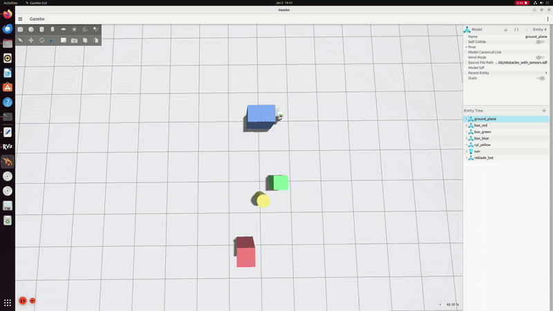

# REBLADE — ROS 2 + Gazebo Harmonic Mobile Robot Simulation

This repository contains a ROS 2 (Humble) simulation architecture built on Gazebo Harmonic (gz-sim) for a differential-drive mobile robot with LiDAR + camera sensors, multiple test worlds, and a lightweight goal-driven reactive navigation demo.

- **ROS 2:** Humble (Ubuntu 22.04)
- **Gazebo:** Harmonic (`gz-sim`)
- **Robot:** Differential-drive (DiffDrive system plugin)
- **Sensors:** GPU LiDAR (`/scan`), Camera (`/camera/image_raw`)
- **Worlds:** Empty, Corridor, Obstacles
- **Visualization:** RViz (RobotModel + TF + Camera)

---

## Architecture

```mermaid
flowchart LR
  subgraph GZ["Gazebo Harmonic (gz-sim)"]
    direction TB
    W["Worlds (SDF)\nEmpty · Corridor · Obstacles"]
    R["Robot Model (URDF)\nDiffDrive system plugin"]
    S["Sensors\nLiDAR (/scan)\nCamera (/camera/image_raw)"]
    O["Odometry + Clock\n/odom · /clock"]
    W --> R --> S
    R --> O
  end

  B["ros_gz_bridge\n(single instance)\nGZ ↔ ROS topics"]

  subgraph ROS["ROS 2 Humble"]
    direction TB
    TF["State & TF\nrobot_state_publisher\nodom → TF"]
    NAV["Navigation Logic\ngoal_nav_avoid\n(~0.18–0.20 m/s)"]
    RV["RViz\nRobotModel · TF · Camera"]
    TF --> RV
    NAV --> C["/cmd_vel"]
  end

  subgraph VAL["Validation & Delivery"]
    T["Metrics & Testing\nhz checks · rosbag replay"]
    G["GitHub Repo\ncode · PDF · demo video"]
    T --> G
  end

  S --> B --> RV
  O --> B --> TF
  C --> B --> R
  ROS --> VAL
````

---

## Project Structure

```
reblade_ws/src/
├── reblade_bot_description/     # URDF/Xacro robot model
├── reblade_bot_bringup/         # launch + RViz config
├── reblade_worlds/              # SDF worlds (empty/corridor/obstacles)
├── reblade_tools/               # helper + navigation nodes
└── reblade_navigation/          # reserved for future Nav2/SLAM

```

---

## Demo

The following short demonstrations show the simulation running in Gazebo and RViz.

### Demo 1: Moving towards a goal
This demo shows the robot navigating through the obstacle-rich environment using goal-driven reactive avoidance.


---

### Demo 2: Coming back to starting position
This demo shows the robot navigating back to its original position, demonstrating stable steering and clearance handling.



---

## Build Instructions

### Dependencies

Assumes ROS 2 Humble and Gazebo Harmonic are installed and working.

### Build

```bash
cd reblade_ws
source /opt/ros/humble/setup.bash
colcon build
source install/setup.bash
```

---

## Launch Commands

All launch commands run through a single bringup entrypoint:

**Template**

```bash
ros2 launch reblade_bot_bringup sim_empty.launch.py world:=<WORLD_FILE>.sdf gazebo_gui:=<true|false> enable_avoidance:=<true|false>
```

### 1) Empty World (baseline)

```bash
ros2 launch reblade_bot_bringup sim_empty.launch.py \
  world:=empty_with_sensors.sdf gazebo_gui:=true enable_avoidance:=false
```

### 2) Corridor World (constrained navigation)

```bash
ros2 launch reblade_bot_bringup sim_empty.launch.py \
  world:=corridor_with_sensors.sdf gazebo_gui:=true enable_avoidance:=true
```

### 3) Obstacles World (reactive avoidance demo)

```bash
ros2 launch reblade_bot_bringup sim_empty.launch.py \
  world:=obstacles_with_sensors.sdf gazebo_gui:=true enable_avoidance:=true
```

> If running inside a VM, headless Gazebo is often more stable:

```bash
ros2 launch reblade_bot_bringup sim_empty.launch.py \
  world:=obstacles_with_sensors.sdf gazebo_gui:=false enable_avoidance:=true
```

---

## Validation / Metrics

Topic rates were validated using:

```bash
ros2 topic hz /scan
ros2 topic hz /camera/image_raw
ros2 topic hz /odom
```

Observed (typical):

* `/scan` ~10 Hz
* `/camera/image_raw` ~15–17 Hz
* `/odom` ~50 Hz

---

## Notes (ros2_control - conceptual)

The current simulation uses Gazebo DiffDrive for motion. The architecture is intentionally compatible with a future `ros2_control` integration (e.g., `diff_drive_controller` + `joint_state_broadcaster` + simulated hardware interface), which would replace the DiffDrive system plugin in a production setup.


